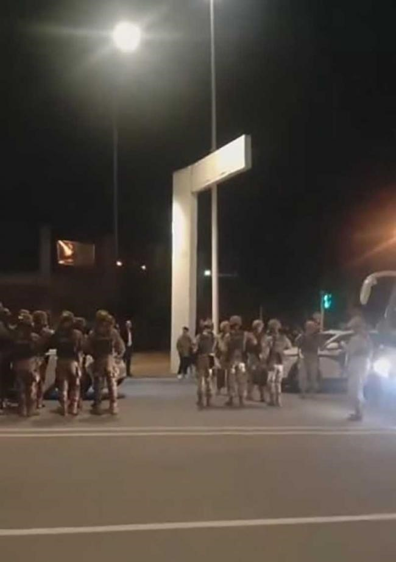

## 时间
2024年2月10日大年初一

## 地点
山东省日照市

## 人物
凶手未知

## 事情
特大枪击案，死亡21人，过去的医生都被干掉了，太惨了。
根据唯一能找到镇政府照片，与视频部分细节对比，应是洛河镇驻地政府门前，慢放可以看到停有数量警车和一定数量的条子，包括特警车辆。正常情况乡镇派出所不会有这种车和这么多人。

## 起因
当局未发布事件起因，据说是因为打工没领导薪水不说，还含冤入狱3年，出狱后来复仇了。
可参考：https://www.youtube.com/watch?v=Gn7DeKNSKBA

## 后续
这件事那自然是被和谐了，网上啥也查不到了。
后面山东开始排查16类人员，大致是：房地产(烂尾)、医患、劳资、婚姻失败、性格偏执、上访、投资失败、失业、精神失常、少管等。
可参考：https://www.youtube.com/watch?v=Od7UjNzjzIA
